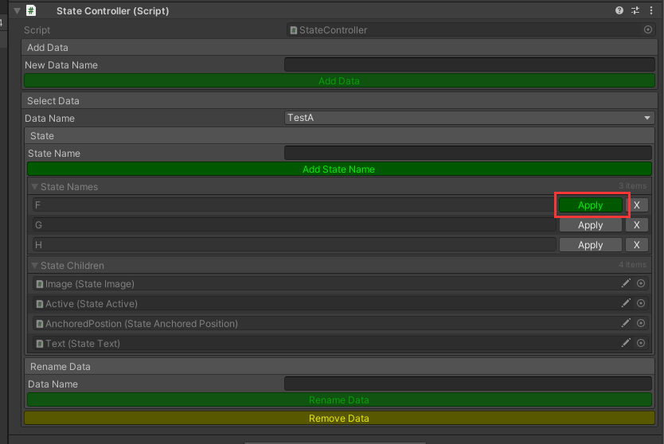

# 状态控制器

参考FairyGui控制器实现的通用性状态控制器，支持任意子状态扩展

## 交流QQ群：949482664

## 说明：

1：布尔逻辑操作的子状态（BaseBooleanLogicState）

2：状态保存选择的子状态（BaseSelectableState）

3：如果安装了[CodeBind](https://github.com/XuToWei/CodeBind)，添加宏"STATE_CONTROLLER_CODE_BIND"即可在绑定代码时候生成状态数据相关代码，极力推荐使用！

4：设置选中状态
```csharp
m_TestController.GetData("AC").SelectedName = "TestStateName";
```

5：点击Apply按钮实现实时预览



### 安装方式：
- Open Package Manager and Add package from git URL https://github.com/XuToWei/StateController.git.

### 该项目依赖以下收费插件（请自行购买安装）：
- [Odin Inspector](https://assetstore.unity.com/packages/tools/utilities/odin-inspector-and-serializer-89041) （编辑器扩展、工作流改善）