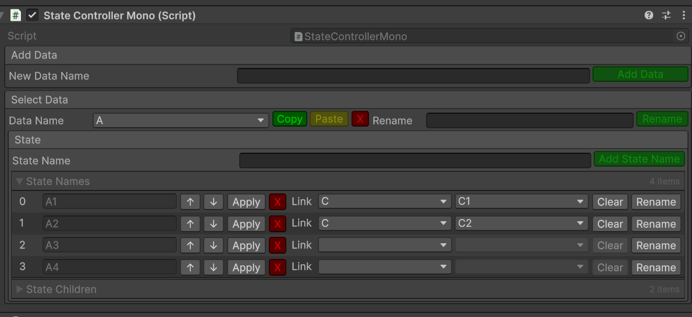

# StateController 状态控制器

参考 FairyGUI 控制器实现的通用性状态控制器，支持任意子状态扩展。适用于 UI 状态切换、角色状态管理、场景状态控制等场景。

## 特性

- 支持任意类型的状态数据（泛型设计）
- 支持布尔逻辑组合（And/Or）
- 支持状态间自动链接切换
- 编辑器实时预览
- 支持 CodeBind 代码生成

## 交流QQ群：949482664

## 核心组件

### 1. StateControllerMono
主控制器组件，挂载在 GameObject 上，管理所有状态数据。

### 2. BaseSelectableState\<T\>
可选择状态基类，用于根据状态名切换不同的数据。

```csharp
// 示例：根据状态切换图片
public class StateImageForSprite : BaseSelectableState<Sprite>
{
    [SerializeField] private Image m_Image;

    protected override void OnStateInit() { }

    protected override void OnStateChanged(Sprite stateData)
    {
        m_Image.sprite = stateData;
    }
}
```

### 3. BaseBooleanLogicState
布尔逻辑状态基类，支持 None、And、Or 三种逻辑类型。

```csharp
// 示例：根据布尔结果控制 GameObject 激活状态
public class StateGameObjectForActive : BaseBooleanLogicState
{
    [SerializeField] private GameObject m_Target;

    protected override void OnStateInit() { }

    protected override void OnStateChanged(bool logicResult)
    {
        m_Target.SetActive(logicResult);
    }
}
```

## 使用方法

### 基本使用

```csharp
// 获取控制器
StateControllerMono controller = GetComponent<StateControllerMono>();

// 通过名称设置状态
controller.SetSelectedName("DataName", "StateName");

// 通过索引设置状态
controller.SetSelectedIndex("DataName", 0);

// 获取当前状态
string currentName = controller.GetSelectedName("DataName");
int currentIndex = controller.GetSelectedIndex("DataName");

// 获取所有状态名
string[] stateNames = controller.GetStateNames("DataName");
```

### 直接操作 Data

```csharp
// 获取数据对象
StateControllerData data = controller.GetData("DataName");

// 设置状态
data.SelectedName = "StateName";
data.SelectedIndex = 0;

// 监听状态变化
data.OnSelectedNameChanged += (name) => Debug.Log($"State changed to: {name}");
data.OnSelectedIndexChanged += (index) => Debug.Log($"Index changed to: {index}");
```

### 编辑器预览
点击 Inspector 中的 **Apply** 按钮可实时预览状态效果。



## 内置扩展

| 类名 | 功能 |
|------|------|
| StateGameObjectForActive | 控制 GameObject 激活状态 |
| StateImageForSprite | 切换 Image 的 Sprite |
| StateImageForSpriteColor | 切换 Image 的 Sprite 和颜色 |
| StateRectTransformForAnchoredPosition | 控制 RectTransform 位置 |
| StateTextForText | 切换文本内容 |

## CodeBind 集成

如果安装了 [CodeBind](https://github.com/XuToWei/CodeBind)，添加宏定义 `STATE_CONTROLLER_CODE_BIND` 即可在绑定代码时生成状态数据相关代码。

## 安装方式

通过 Unity Package Manager 安装：
1. 打开 Window > Package Manager
2. 点击 "+" 按钮，选择 "Add package from git URL..."
3. 输入：`https://github.com/XuToWei/StateController.git`

## 依赖

- Unity 2019.4+
- [Odin Inspector](https://assetstore.unity.com/packages/tools/utilities/odin-inspector-and-serializer-89041)（收费插件，请自行购买安装）

## 许可证

MIT License